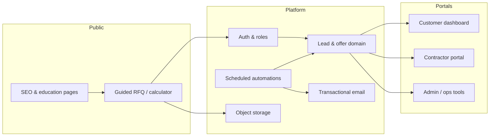
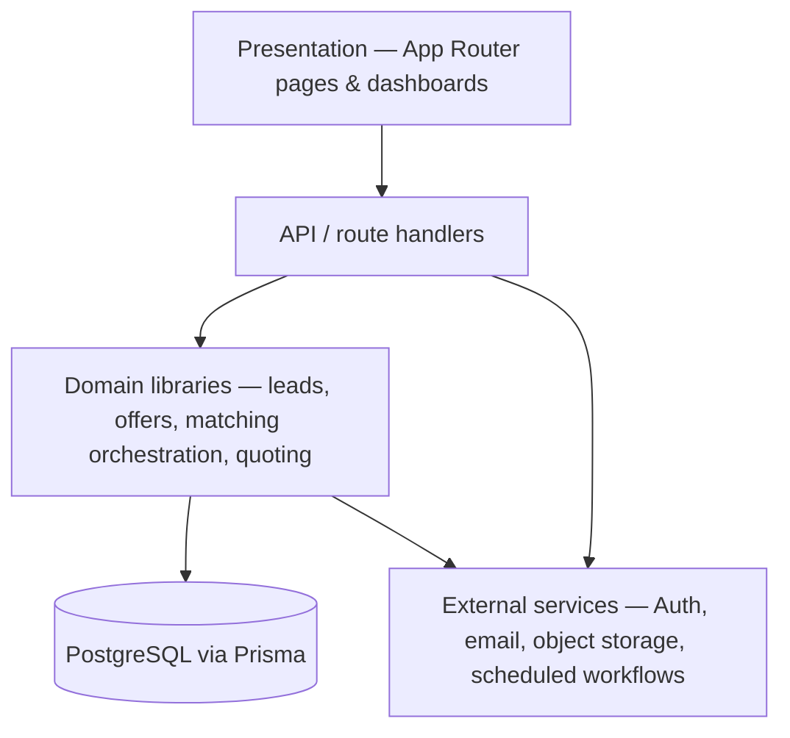

# SaulėsPro.lt — Architecture Showcase

**Status:** Production platform, actively maintained  
**Role:** Full-Stack Developer & Product Owner  
**Period:** November 2025 – present  

Public architecture and product-engineering overview of a multi-role B2B2C marketplace connecting residential solar customers with installation contractors in Lithuania.

> The production source code is private. This repository describes the system’s responsibilities, architecture, workflows and engineering decisions without exposing proprietary matching rules, pricing logic, customer data or operational playbooks.

The platform is **deployed and operational**; commercial adoption and marketplace growth are ongoing. That distinction matters: “production” here means live software under active ownership, not a claim of finished market scale.

---

## Context

**[SaulėsPro.lt](https://saulespro.lt)** is not “a form and a CRM.” The hard problem is reducing sales-cycle friction across three parties (customer, contractor, platform) while protecting personal data until a deliberate match, keeping contractor response quality high, and automating operational work that otherwise dies in email threads.

**My role:** product ownership + hands-on delivery — requirements, architecture, implementation, production maintenance, and process documentation.

---

## What recruiters should see

| Signal | Evidence in this product |
|--------|--------------------------|
| End-to-end ownership | Live B2B2C platform from RFQ → offers → match → follow-up |
| Multi-role product design | Separate authenticated experiences for customers, contractors, and admins |
| Workflow automation | Scheduled jobs, transactional email, SLA-driven lifecycle orchestration |
| Integration depth | Auth, PostgreSQL, object storage, email APIs, scheduled workflows |
| Domain modelling | Solar/grid constraints, offer comparison, lead distribution, quality signals |
| Operational maturity | CI gates; extensive process and architecture documentation supporting production maintenance and change control; production debugging |

---

## System at a glance

High-level request flow (intentionally abstract — no proprietary timings or ranking rules):

### Architecture layers

Business rules live in domain libraries — not scattered across page components:

---

## Capability map (not internals)

### 1. Guided RFQ & technical intake
Multi-step calculator that collects installation intent and technical context (grid limits, hybrid vs standard configurations, expansion scenarios, optional site media). Designed for conversion: high-friction steps are deferred or collapsed so planners and buyers can finish without expert-level knowledge.

**Skills:** UX friction reduction, domain form design, file upload pipelines, progressive disclosure.

### 2. Privacy-controlled marketplace
Contractors compete with structured offers; customer contact details stay protected until a match is confirmed (manual selection or rule-driven lifecycle progression). Comparison UI helps customers evaluate proposals without exposing the full lead prematurely.

**Skills:** authorization boundaries, data minimization, multi-tenant dashboards, offer lifecycle states.

### 3. Matching, SLA & lifecycle automation
Time-bound competition windows, reminders, automated match progression, and one-click customer opt-out with structured feedback. Quiet-hours / digest patterns reduce noise for contractors while keeping the market moving.

**Skills:** state machines, cron/job design, transactional messaging, feedback loops for analytics.

### 4. Contractor productivity (catalogue-driven offer drafting)
Contractors maintain product catalogues and rate structures so the platform can draft preliminary offers for contractor review before customer visibility — reducing the manual quoting friction that kills marketplace liquidity.

**Skills:** catalogue modelling, pricing composition, draft → review → submit workflows, background generation jobs.

### 5. Quality & distribution controls
Contractor performance signals (response behaviour, conversion, data quality) inform visibility and distribution, alongside capacity and availability guards that limit overload.

**Skills:** product-level scoring concepts, fair distribution rules, operational safeguards.

### 6. Win-back & competitive context (customer-side)
Customers can surface an external offer from their dashboard so contractors can respond competitively — without forcing a full re-RFQ.

**Skills:** secondary conversion funnels, document handling, cross-role notification design.

### 7. Admin & operations surface
Partner verification, lead oversight, operational tooling, and platform health — so a small team can run a trust-sensitive marketplace with accountability.

**Skills:** ops UX, auditability, support workflows, documentation-driven delivery.

---

## Example engineering decision

**Problem:** Contractors could receive more leads than they could process, reducing response quality and customer trust.

**Decision:** Lead distribution was separated from simple first-come allocation and made dependent on capacity, availability and quality signals.

**Result:** The platform can control lead exposure while preserving customer privacy and avoiding contractor overload.

**Trade-off:** The exact weighting and thresholds remain private because they form part of the marketplace’s commercial logic.

---

## Role surfaces

| Role | Primary jobs |
|------|----------------|
| **Customer** | Complete RFQ, compare offers, choose / opt out, upload competitive context |
| **Contractor** | Respond to leads, manage catalogue & offer-drafting settings, track outcomes |
| **Admin** | Verify partners, monitor lifecycle health, intervene when needed |
| **Platform (jobs)** | SLA monitoring, offer drafting jobs, digests, transactional communication |

---

## Technology stack (public)

Aligned with what runs in production — names only, no infra secrets:

| Layer | Choices |
|-------|---------|
| App | **Next.js** (App Router), **React**, **TypeScript** |
| Data | **PostgreSQL**, **Prisma ORM**, **Supabase** |
| Auth | **NextAuth** (credentials / OTP / OAuth patterns) |
| Storage | **Cloudflare R2**, **AWS S3** (media & documents) |
| Comms | **Resend** (transactional email) |
| UI | **Tailwind CSS**, accessible component primitives |
| Quality | Lint, docs checks, unit tests, CI build; heavier E2E when touching critical flows |
| Ops | GitHub Actions, secured scheduled workflows, production monitoring and maintenance |

---

## Engineering practices that mattered

- **Process documentation as product asset** — lifecycle, billing concepts, ops playbooks, and architecture notes kept alongside code so changes stay reviewable.
- **Clear module boundaries** — UI routes vs domain libraries vs API handlers; business rules live in libraries, not scattered across pages.
- **Automation with human checkpoints** — generated offers and match progression are designed for review / opt-out, not blind fire-and-forget.
- **Production ownership** — deploy, debug, migrate, and communicate with contractors when behaviour changes.

---

## Scope intentionally omitted

To protect intellectual property and partner trust, this showcase does **not** include:

- Proprietary ranking / matching formulas or exact SLA schedules  
- Database schemas, migrations, or seed data  
- API contracts, tokens, or environment configuration  
- Contractor commercial terms or partner-specific CRM notes  
- Source code from the private application repository  

If you are hiring for automation, solutions, or product-engineering roles and want a deeper technical walkthrough under NDA, contact me.

---

## About the author

**Paulius Medžiukevičius**  
Technical Solutions & Automation Specialist · Vilnius, Lithuania  

Product-oriented full-stack delivery · Workflow automation · API & LLM integrations · FinTech background  

- Email: [pauliusmed@gmail.com](mailto:pauliusmed@gmail.com)  
- LinkedIn: [linkedin.com/in/paulius-medžiukevičius](https://www.linkedin.com/in/paulius-medziukevi%C4%8Dius-003586168/)

---

*Last updated: July 2026 · Showcase only — not the production codebase.*
